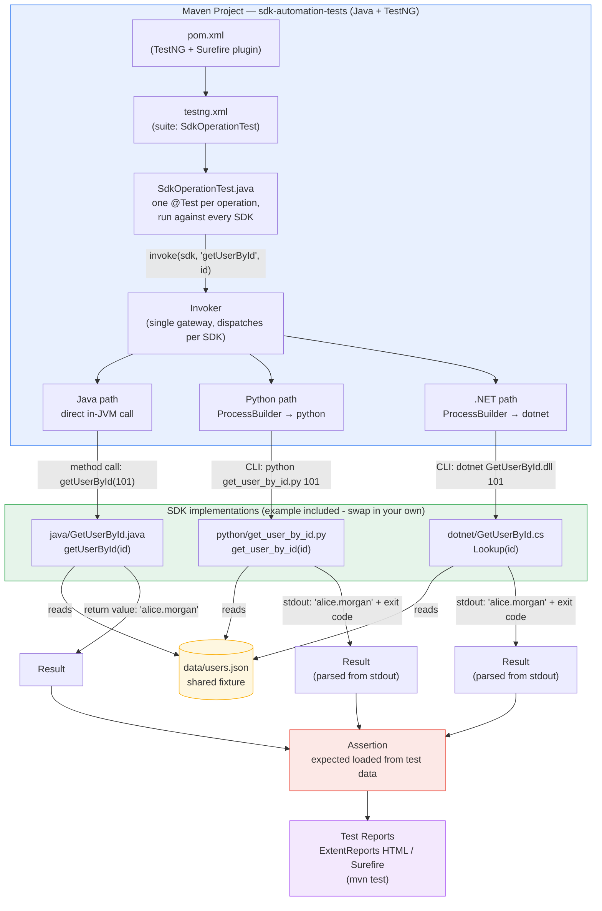

# SDK Test Automation Framework

[](https://github.com/shantanuchandalia/SDK-Test-Automation-Framework/actions/workflows/ci.yml)

A test-automation framework for SDKs shipped in multiple languages.
Write a behavioural scenario once, and one TestNG suite asserts the same
expectations against every language implementation — Java, Python, and
.NET out of the box, with a small seam for adding more. Fork it, swap in
your SDK, and keep the test layer.

> [!TIP]
> **This repo ships an agent skill:**
> [`.claude/skills/sdk-framework/SKILL.md`](.claude/skills/sdk-framework/SKILL.md)
> encodes the framework's workflows — add an operation across all
> languages, add a language, run and debug the suite. AI coding agents
> that support the SKILL.md convention (e.g. Claude Code) discover it
> automatically when you open a clone of this repo, so "add a
> getOrderStatus operation" becomes a guided, contract-correct change.
> It reads as plain documentation for everyone else.

## What this achieves

Teams that ship the same SDK in several languages hit two problems:

1. **Behaviour drift.** Implementations diverge silently: one handles an
   edge case, another crashes on it, a third returns something subtly
   different. Nothing catches it because each language is tested (or
   not) in its own silo.
2. **Staffing.** Testing three language SDKs the obvious way needs QA
   engineers fluent in Java *and* Python *and* C#. Those are rare —
   and you shouldn't need them.

The framework's answer to both: the **entire test layer — scenarios,
test data, assertions, reporting — is plain Java + TestNG**, the stack
most SDET/QAE teams already work in. The invoker layer executes each
language's SDK behind one interface, so a Java-skilled QA engineer
writes and maintains parity tests for every language without writing a
line of Python or C#. The only non-Java code in the picture is the SDK
under test itself — which belongs to the SDK developers, not QA.

Concretely, cross-language parity becomes a tested contract:

- **One suite, one assertion path.** Every language implementation runs
  the same scenarios through the same assertions — parity is proven, not
  assumed.
- **Operations scale by data, not boilerplate.** Adding an SDK operation
  is one registry entry plus one data-driven test method. No per-language
  test classes, no per-language invocation code.
- **Languages scale by one interface.** Adding a language means
  implementing a single small strategy interface and one enum constant.
- **Missing toolchains skip, they don't fail.** If a machine lacks the
  .NET SDK, those cases are reported as skipped with the reason — the
  other languages still run and the suite stays green.
- **Evidence built in.** Per-SDK grouped ExtentReports HTML output, and
  CI that runs the full three-language suite on every push.

## How it works

Tests call `Invoker.invoke(sdk, "operationName", args...)`. The
`OperationRegistry` maps the operation name to its per-language binding
(`OperationSpec`); a per-language `SdkInvocationStrategy` then executes
it — the Java SDK in-JVM via reflection, Python and .NET as CLI
subprocesses. Whatever comes back is normalized into one `Result`
(`exitCode`, parsed `value`, raw output) that the shared assertions in
`BaseTest` consume.

The overview diagram is embedded under
[Architecture flow](#architecture-flow) below; see
[framework-flow-detailed.mermaid](framework-flow-detailed.mermaid) for the
package/class-level drilldown.

### The cross-language contract

The single suite can treat all languages identically because every SDK
implementation honours the same convention:

| Behaviour   | Exit code | Stdout                              |
|-------------|-----------|-------------------------------------|
| Success     | 0         | `operation(args) -> result`         |
| Not found   | 1         | message without the `-> ` marker    |
| Bad input   | 2         | `ERROR: ...`                        |

Implement this contract in your SDK's CLI surface and the framework needs
no other knowledge of the language.

## Structure

```
SDK Test Automation Framework/
├── .claude/skills/sdk-framework/
│   └── SKILL.md              # agent skill: guided extend/run workflows (see tip above)
├── .github/workflows/ci.yml  # GitHub Actions: full suite on every push/PR
├── data/
│   └── users.json            # example shared fixture (single source of truth)
├── java/                     # example SDK implementation: Java (plain JDK 11+)
├── python/                   # example SDK implementation: Python 3.8+, stdlib only
├── dotnet/                   # example SDK implementation: .NET 8, zero packages
├── tests/                    # the framework: Maven + TestNG
│   ├── pom.xml               # TestNG 7.10.2 + ExtentReports 5.1.2
│   ├── testng.xml            # suite: sdk.tests.SdkOperationTest
│   └── src/test/java/sdk/
│       ├── tests/                     # actual test classes (@Test methods)
│       │   └── SdkOperationTest.java      # one @DataProvider/@Test pair per operation
│       ├── util/                      # shared test utilities, not tests themselves
│       │   └── BaseTest.java              # ExtentReports lifecycle, crossWithSdk(), requireSdk()
│       └── invoker/                   # invocation framework, kept apart from test classes
│           ├── Sdk.java                   # enum: JAVA, PYTHON, DOTNET
│           ├── OperationSpec.java         # one operation's per-language binding
│           ├── OperationRegistry.java     # registered operations (add here to add an operation)
│           ├── SdkInvocationStrategy.java # interface: how a language is invoked + availability
│           ├── Invoker.java               # gateway: invoke(sdk, operationName, args...)
│           ├── CliSupport.java            # repo-root discovery + shared CLI runner
│           ├── java/JavaInvocationStrategy.java       # in-JVM via reflection
│           ├── python/PythonInvocationStrategy.java   # CLI: python <script> <args>
│           └── dotnet/DotnetInvocationStrategy.java   # CLI: dotnet <dll> <args> + build probe
├── docs/
│   └── ExtentReport-sample.html  # sample of the generated HTML report
├── framework-flow.mermaid           # architecture overview diagram
└── framework-flow-detailed.mermaid  # same flow, package/class-level drilldown
```

## Architecture flow



The same flow at package/class level lives in
[framework-flow-detailed.mermaid](framework-flow-detailed.mermaid).

## Running the suite

From `tests/` (needs Maven, JDK 11+, Python 3; .NET 8 SDK optional):

```
mvn test
```

- 23 tests with the included example: 7 boundary-value cases x 3
  languages, plus a bad-input (exit code 2) case per CLI-invoked SDK
- The .NET project is built automatically once per suite if its DLL is missing
- Missing toolchains skip with a reason instead of failing the suite
- Extent report: `tests/target/ExtentReport.html`; Surefire reports in
  `tests/target/surefire-reports/`

### Testing model: in-JVM vs CLI

The Java SDK is tested **in-JVM at the library layer** (a direct call to
the SDK method — its CLI `main()` wrapper is not exercised). The Python
and .NET SDKs are tested **at the process level through their CLI entry
points**, which additionally covers their argument parsing and exit
codes. This is a deliberate trade-off (speed and simplicity for the
host-language SDK); it is why the bad-input test applies only to the two
CLI-invoked SDKs.

## Adapting it to your SDK

The workflows below are also encoded in the repo's
[agent skill](.claude/skills/sdk-framework/SKILL.md), so an AI coding
agent can execute them for you end-to-end.

**Add an operation** (the everyday case):

1. Implement the operation in each language, honouring the
   [cross-language contract](#the-cross-language-contract).
2. Register it — one `OperationSpec` entry in `OperationRegistry`
   (Java class/method/param types, Python script, .NET DLL).
3. Test it — one `@DataProvider`/`@Test` pair in `SdkOperationTest`;
   `crossWithSdk()` fans your data rows out across every language.

**Add a language:**

1. Implement `SdkInvocationStrategy` for it (see
   `PythonInvocationStrategy` for the CLI pattern — ~20 lines); override
   `availabilityProblem()` if its toolchain may be absent.
2. Add a constant to the `Sdk` enum and register the strategy in
   `Invoker`'s strategy map.
3. Done — every existing test now also runs against the new language.

**Replace the example:** swap the `java/`, `python/`, `dotnet/` folders
and `data/users.json` with your SDK and fixtures, update the registry
entry, and keep the test data as your own scenarios.

## The included example: getUserById

The repo ships with one complete worked operation so a fork starts from
something running: `getUserById(id)` implemented in all three languages,
each reading the shared flat file `data/users.json` and returning the
username for a given user ID.

Each implementation also runs standalone (with no argument it does a demo
lookup for ID 101):

```
# from python/
python get_user_by_id.py 103

# from java/
javac GetUserById.java && java GetUserById 102

# from dotnet/ (requires .NET 8 SDK)
dotnet run -- 104
```

Example data:

| id  | username      |
|-----|---------------|
| 101 | alice.morgan  |
| 102 | bob.sharma    |
| 103 | carol.tan     |
| 104 | david.oconnor |
| 105 | eva.kapoor    |
